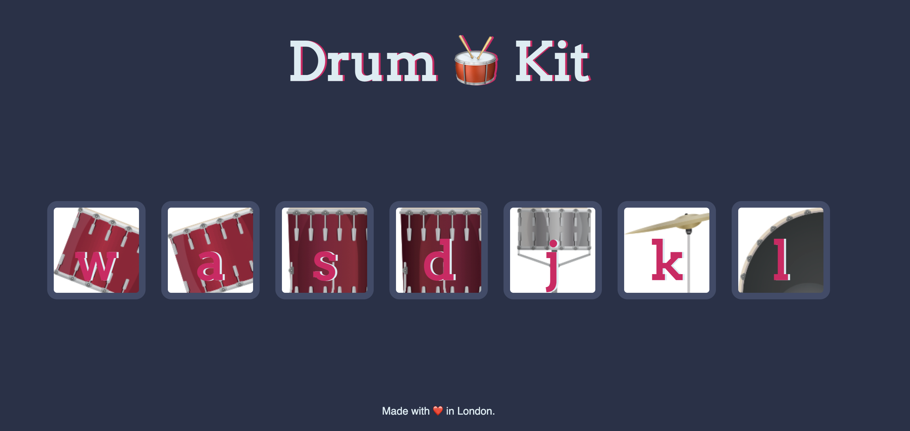

## Drum Kit Project

### Overview

- This Drum Kit project is an interactive web application designed to play drum sounds when specific keys are pressed.
- It's a hands-on practice of JavaScript event handling and DOM manipulation.

## Technologies Used

- HTML5
- CSS3
- JavaScript

## Features

- **Interactive Keyboard:** Press designated keys to play different drum sounds.
- **Visual Feedback:** Visual cues highlight the drum keys when they are played.
- **Sound Effects:** Each key is mapped to a unique drum sound, creating a virtual drum kit experience.

## Live Demo

